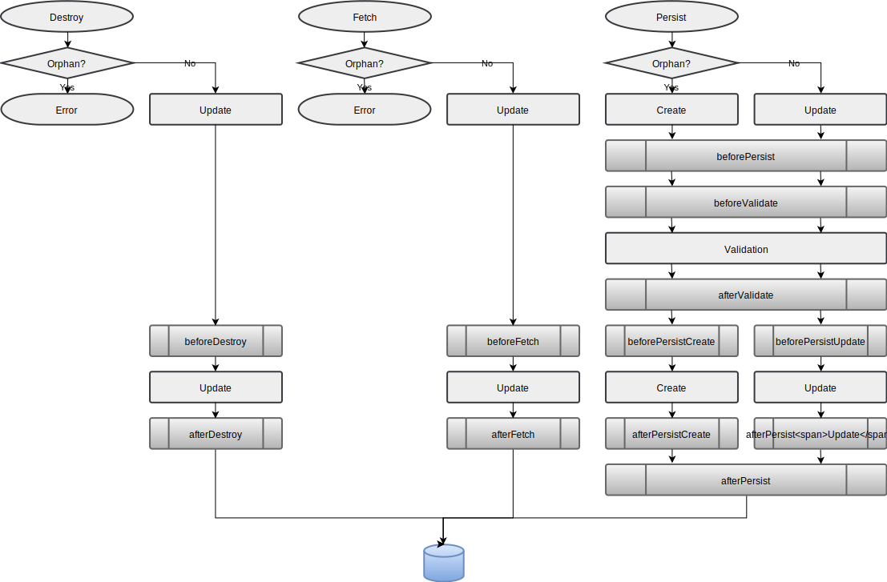
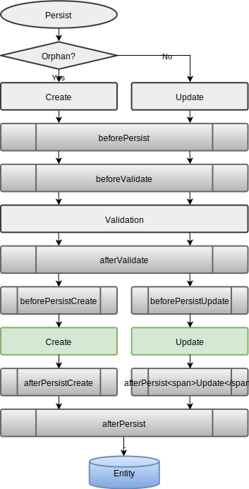
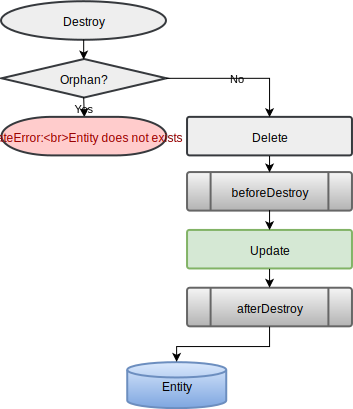

# Events in Diaspora

Diaspora rellies, for many functionnalities, on event emitters. Entities, sets (and later models) are event emitters, and listening those events allow you to customize Diaspora's behavior.

## Lifecycle events

Lifecycle events are events applied on *Entities* and *Sets*, and may be used as pre or post operation hooks. You can check the documentation of [SequentialEvents](https://gerkindev.github.io/SequentialEvent.js/) for informations about events functions. You'll find bellow all events callbacks that are triggered on *Entities* and *Sets*:

### All events

### Persist

### Fetch

### Destroy

To configure lifecycle events when creating your model, you can do as follow:


const PhoneBook = Diaspora.declareModel( NAMESPACE, 'PhoneBook', {
	sources:         /* ... */,
	attributes:      /* ... */,
	lifecycleEvents: {
		beforePersist: function( dataSoureName ){
			console.log( `Trying to persist ${this.toObject()} in data source ${ dataSoureName }` );
		},
		afterPersist:  /* ... */,
		/* All events described above can be bound here */
	}
});
